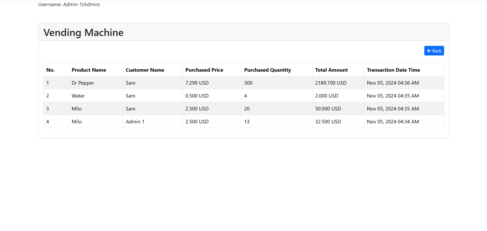

# Product List


# Purchase Product Page


# Transaction List


# Vending Machine

A robust PHP application for a vending machine system.

This system support features like product management, inventory tracking, purchase transactions, and user authentication.

## Installation


(1) Installing dependencies


```bash
  composer install
```


(2) Migration and seeding


Configure your database in the .env file.otherwise copy .env.example .


Then, run the following command -


 ```bash
  php artisan migrate
```

```bash
  php artisan db:seed
```

(3) Run the project

```bash
  php artisan serve
```

Done!! The application should now be running on your localhost at port 8000.

## Accounts

(1) Admin Accounts

- admin1@gmail.com
- admin2@gmail.com

(2) User Accounts

- john@gmail.com
- sam@gmail.com

  Default password is "password".

  Or just register to create a user account.
  
  Login route  is '/login'.
  
  Register route  is '/register'.

    
## Features

- Product CRUD
- User Authenthication & Authorization
- Purchase Product
- Transaction History

## Languages

PHP, Javascript, Mysql

## Tech Stack

Laravel Framework

## Authors

- [@pyaepyaehan](https://github.com/PyaeHan)
